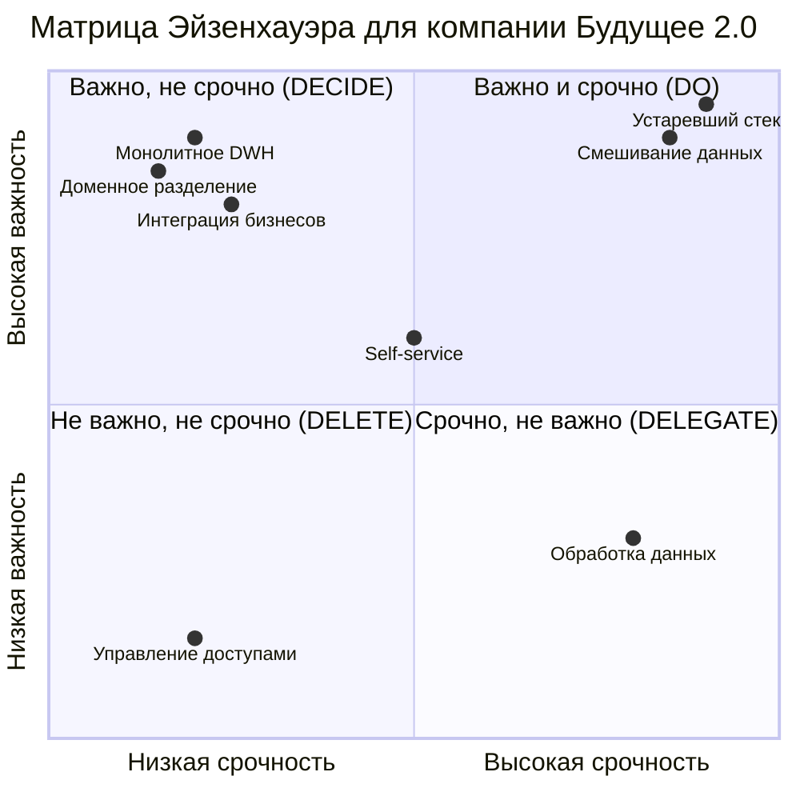

# Задание 1

1. **Спроектируйте архитектуру системы через год.** Составьте диаграмму контейнеров в модели C4.
2. **Опишите проблемные места.** Сделайте это в удобной для вас форме. Например, можете использовать список или таблицу. Постарайтесь формулировать описания так, чтобы они были понятны не только инженерам, но и бизнесу.
3. **Приоритизируйте выявленные проблемы.** Для этого вы можете использовать методы, которые изучили на курсе. Например, MoSCoW или матрицу Эйзенхауэра.

## 1. Диаграмма контейнеров C4 - целевая архитектура через год

См. [диаграмму](c4_container.plantuml)

## 2. Проблемные места текущей архитектуры

| № | Категория | Проблема | Описание | Влияние на бизнес | Техническое влияние |
|---|-----------|----------|----------|-------------------|-------------------|
| 1 | Архитектурная | Монолитное хранилище данных | Все данные компании сосредоточены в одном DWH на устаревшем MS SQL Server 2008 | Медленные отчеты (часы ожидания), сложность масштабирования при росте бизнеса | Узкое место производительности, сложность добавления новых источников данных |
| 2 | Архитектурная | Отсутствие доменного разделения | Медицинские, финансовые и операционные данные смешаны в одной системе | Сложность независимого развития бизнес-направлений, конфликты требований | Высокая связанность компонентов, трудности в управлении изменениями |
| 3 | Архитектурная | Устаревший технологический стек | MS SQL Server 2008, Power Builder - технологии 15-летней давности | Высокие затраты на поддержку, риски безопасности, ограниченные возможности | Отсутствие современных возможностей BI, проблемы с интеграцией |
| 4 | Функциональная | Отсутствие self-service возможностей | Пользователи не могут самостоятельно создавать отчеты и анализы | Медленное получение инсайтов, зависимость от IT-команды | Высокая нагрузка на разработчиков, много типовых запросов |
| 5 | Функциональная | Неэффективная обработка больших объемов данных | Сотни терабайт данных обрабатываются неоптимально | Долгое время выполнения сложных отчетов, ограничения в аналитике | Высокое потребление ресурсов, проблемы с concurrent доступом |
| 6 | Функциональная | Ограниченная интеграция новых бизнесов | Сложности с подключением фармацевтических компаний и производителя медоборудования | Медленный time-to-market новых продуктов, неполная картина бизнеса | Необходимость значительных доработок DWH для каждого нового источника |
| 7 | Безопасность и соответствие | Смешивание чувствительных данных | Медицинские данные и финансовая информация в одной системе без четкого разделения | Риски нарушения требований регуляторов, потенциальные штрафы | Сложность настройки granular доступов, риски утечек |
| 8 | Безопасность и соответствие | Отсутствие современного управления доступами | Устаревшая система авторизации не поддерживает role-based access control | Ограничения в делегировании прав, риски несанкционированного доступа | Сложность аудита, ручное управление правами |

## 3. Приоритизация проблем (матрица Эйзенхауэра)

