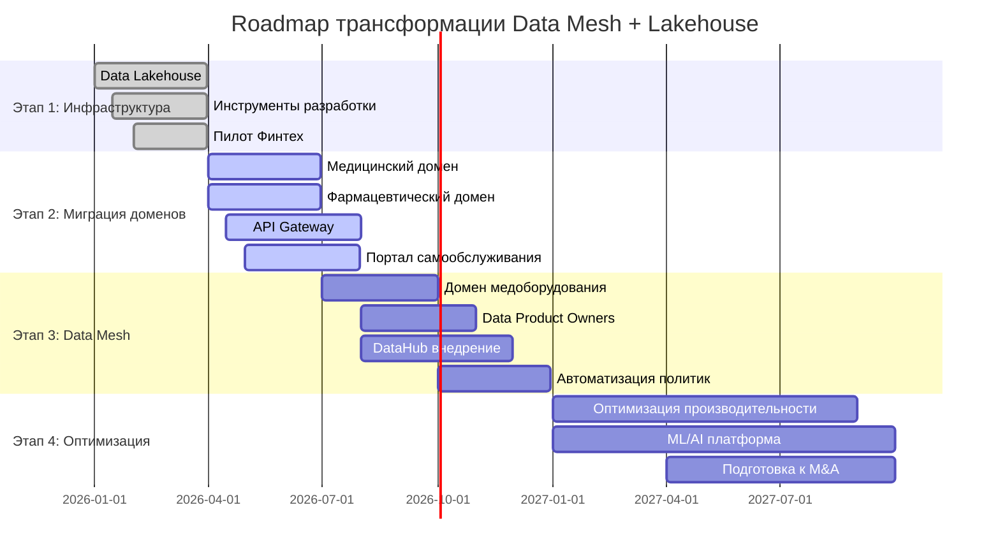
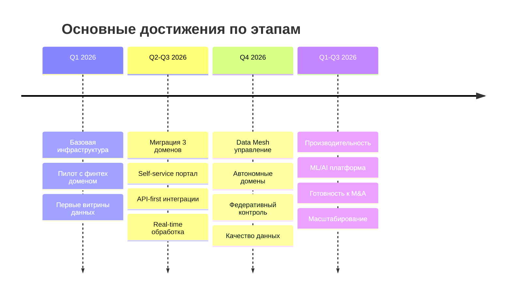

# Задание 3

1. **Сформируйте технический радар.** Отразите на нём текущие технологии и методологии, а также предлагаемые изменения и технологии, которые сопутствуют основному стеку. Оформите радар в виде таблицы или круговой диаграммы.
2. **Составьте роадмап.** Отразите здесь изменения в технологическом ландшафте компании. Радар должен содержать этапы, их результаты, ответственные команды и ресурсы, которые потребуются. Оформите роадмап в draw.io или в другом инструменте на свой выбор.
3. **Обоснуйте изменения.** Опишите, зачем нужен каждый из этапов, которые вы включили в роадмап. Можете сделать это в том же файле, что и сам артефакт.

## 1. Технический радар для трансформации архитектуры данных

### Текущие проблемы vs Целевые решения

| **Проблема** | **Текущее состояние** | **Целевое решение** | **Статус** |
|--------------|----------------------|-------------------|------------|
| Монолитное хранилище | MS SQL Server 2008 DWH | Data Lakehouse (MinIO + Iceberg) | HOLD → ADOPT |
| Медленная обработка | Часы на сложные отчеты | Spark + оптимизированные витрины | HOLD → ADOPT |
| Отсутствие доменного разделения | Все данные в одной системе | Data Mesh архитектура | HOLD → ADOPT |
| Отсутствие self-service | Зависимость от IT | Портал самообслуживания (Dremio) | - → ADOPT |
| Сложная интеграция | Монолитные ETL | API-first + событийная архитектура | HOLD → ADOPT |

---

### Технический радар по категориям

#### Языки и фреймворки

| **Технология** | **Статус** | **Обоснование** | **Временные рамки** |
|----------------|------------|-----------------|-------------------|
| **Python** | **ADOPT** | Основной язык для data engineering, ML, аналитики | Q1 |
| **SQL** | **ADOPT** | Универсальный язык запросов для всех пользователей | Постоянно |
| **Scala** | **TRIAL** | Для Spark разработки, требует экспертизы | Q2-Q3 |
| **Java** | **ASSESS** | Для enterprise интеграций, существующие финтех сервисы | Q3-Q4 |
| **PySpark** | **ADOPT** | Ключевой фреймворк для обработки больших данных | Q1 |
| **Power Builder** | **HOLD** | Legacy интерфейс, подлежит замене | Постепенный вывод |

#### Практики и паттерны

| **Практика** | **Статус** | **Обоснование** | **Временные рамки** |
|--------------|------------|-----------------|-------------------|
| **Data Mesh** | **ADOPT** | Решает проблему масштабирования и доменного разделения | Q1 - Q4 2026 |
| **Domain-Driven Design** | **ADOPT** | Основа для выделения доменов данных | Q1 |
| **Data Product Thinking** | **ADOPT** | Данные как продукт с владельцами и SLA | Q2 |
| **API-First Design** | **ADOPT** | Стандартизация интеграций между доменами | Q2 |
| **Event-Driven Architecture** | **TRIAL** | Real-time обработка через Kafka | Q2-Q3 |
| **DataOps** | **ADOPT** | CI/CD для пайплайнов данных | Q1 |
| **Data Contracts** | **TRIAL** | Формализация соглашений между доменами | Q3 |
| **Федеративное управление** | **ADOPT** | Баланс автономии и централизованного контроля | Q4 |
| **Монолитная архитектура данных** | **HOLD** | Текущий подход, препятствует масштабированию | Постепенный отказ |

#### Платформы

| **Платформа** | **Статус** | **Обоснование** | **Временные рамки** |
|---------------|------------|-----------------|-------------------|
| **Data Lakehouse** | **ADOPT** | Сочетает преимущества DWH и Data Lake | Q1 |
| **Apache Spark** | **ADOPT** | Де-факто стандарт для обработки больших данных | Q1 |
| **Kubernetes** | **ADOPT** | Оркестрация контейнеров для масштабируемости | Q1 |
| **Apache Kafka** | **ADOPT** | Streaming платформа для real-time данных | Q2 |
| **Cloud Platform** (Яндекс Облако) | **TRIAL** | Managed сервисы для снижения операционных затрат | Q2-Q3 |
| **MS SQL Server 2008** | **HOLD** | Устаревшая платформа, требует замены | Миграция до Q4 |
| **Power BI (Legacy)** | **HOLD** | Заменяется на современные self-service решения | Постепенный отказ |

#### Инструменты

| **Инструмент** | **Статус** | **Обоснование** | **Временные рамки** |
|----------------|------------|-----------------|-------------------|
| **Apache Iceberg** | **ADOPT** | Управление метаданными и транзакциями в Data Lake | Q1 |
| **Apache Nessie** | **TRIAL** | Версионирование данных, Git для данных | Q1 |
| **MinIO** | **ADOPT** | S3-совместимое объектное хранилище | Q1 |
| **DataHub** | **ADOPT** | Каталог метаданных и data lineage | Q2 |
| **Apache Airflow** | **ADOPT** | Оркестрация ETL/ELT пайплайнов | Q1 |
| **Dremio** | **TRIAL** | Self-service аналитика поверх Data Lakehouse | Q2 |
| **Apache Superset** | **ASSESS** | Альтернатива Dremio для визуализации | Q3 |
| **Kong API Gateway** | **ADOPT** | Управление API между доменами | Q2 |
| **Prometheus + Grafana** | **ADOPT** | Мониторинг инфраструктуры и пайплайнов | Q1 |
| **Jupyter Notebooks** | **ADOPT** | Исследовательская аналитика | Q1 |
| **Great Expectations** | **TRIAL** | Тестирование качества данных | Q3 |
| **MLflow** | **ASSESS** | Управление ML экспериментами | Q4 |
| **Apache Camel (Legacy)** | **HOLD** | Старая шина данных, заменяется на API+Kafka | Постепенный отказ |

---

### Приоритизация внедрения

#### Q1 - Фундамент (ADOPT сейчас)

- Apache Iceberg + MinIO (Data Lakehouse)
- Apache Spark + PySpark
- Apache Airflow
- Python ecosystem
- DataOps практики

#### Q2 - Интеграция (TRIAL → ADOPT)

- Apache Nessie
- API Gateway
- DataHub
- Data Mesh принципы
- Event-Driven Architecture

#### Q3 - Оптимизация (ASSESS → TRIAL)

- Advanced API patterns
- Cloud-native решения
- Data Contracts

#### Q4 - Инновации (новые ASSESS)

- MLflow
- Advanced ML платформы
- Federated learning
- Real-time ML inference

---

### Статусы объяснения

- **🟢 ADOPT** - Проверенные технологии, рекомендуемые к широкому использованию
- **🟡 TRIAL** - Перспективные технологии, готовые для пилотных проектов  
- **🔵 ASSESS** - Многообещающие технологии для изучения и экспериментов
- **🔴 HOLD** - Технологии, от которых планируется отказ

Этот технический радар обеспечит поэтапную трансформацию с минимизацией рисков и максимизацией бизнес-ценности.

## 2. Roadmap трансформации архитектуры данных

### Ключевые вехи по кварталам

## 3. Обоснуйте изменения Ключевая логика последовательности:

Этап 1 - Создание безопасного фундамента без рисков для текущего бизнеса
Этап 2 - Масштабирование на критичные домены с доказанными решениями
Этап 3 - Достижение автономности доменов и операционной зрелости
Этап 4 - Оптимизация для роста и подготовка к стратегическим целям